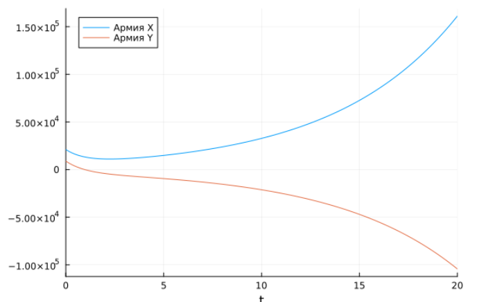

---
## Front matter
title: "Лабораторная работа №3"
subtitle: "Модель боевых действий"
author: "Сахно Никита Вячеславович"

## Generic otions
lang: ru-RU
toc-title: "Содержание"

## Pdf output format
toc: true # Table of contents
toc-depth: 2
lof: true # List of figures
lot: false # List of tables
fontsize: 12pt
linestretch: 1.5
papersize: a4
documentclass: scrreprt
## I18n polyglossia
polyglossia-lang:
  name: russian
  options:
    - spelling=modern
    - babelshorthands=true
polyglossia-otherlangs:
  name: english
## I18n babel
babel-lang: russian
babel-otherlangs: english
## Fonts
mainfont: PT Serif
romanfont: PT Serif
sansfont: PT Sans
monofont: PT Mono
mainfontoptions: Ligatures=TeX
romanfontoptions: Ligatures=TeX
sansfontoptions: Ligatures=TeX,Scale=MatchLowercase
monofontoptions: Scale=MatchLowercase,Scale=0.9
## Biblatex
biblatex: true
biblio-style: "gost-numeric"
biblatexoptions:
  - parentracker=true
  - backend=biber
  - hyperref=auto
  - language=auto
  - autolang=other*
  - citestyle=gost-numeric
## Pandoc-crossref LaTeX customization
figureTitle: "Рис."
tableTitle: "Таблица"
listingTitle: "Листинг"
lofTitle: "Список иллюстраций"
lotTitle: "Список таблиц"
lolTitle: "Листинги"
## Misc options
indent: true
header-includes:
  - \usepackage{indentfirst}
  - \usepackage{float} # keep figures where there are in the text
  - \floatplacement{figure}{H} # keep figures where there are in the text
---

# Цель работы
Построить математическую модель боевых действий и провести анализ.

# Задание
Между страной Х и страной У идет война. Численность состава войск
исчисляется от начала войны, и являются временными функциями xt( ) и yt( ).
В начальный момент времени страна Х имеет армию численностью 21 050 человек, а
в распоряжении страны У армия численностью в 8 900 человек. Для упрощения
модели считаем, что коэффициенты a b c h , , , постоянны. Также считаем Pt( ) и Q t( ) непрерывные функции.
Постройте графики изменения численности войск армии Х и армии У для
следующих случаев:
1. Модель боевых действий между регулярными войсками
2. Модель ведение боевых действий с участием регулярных войск и
партизанских отрядов

# Теоретическое введение
Рассмотрим некоторые простейшие модели боевых действий – модели
Ланчестера. В противоборстве могут принимать участие как регулярные войска,
так и партизанские отряды. В общем случае главной характеристикой соперников
являются численности сторон. Если в какой-то момент времени одна из
численностей обращается в нуль, то данная сторона считается проигравшей (при
условии, что численность другой стороны в данный момент положительна).

# Выполнение лабораторной работы

## Модель боевых действий между регулярными войсками
Модель боевых действий между регулярными войсками. Зададим коэффециент смертности, не связаный с боевыми действиями у первой армии это 0.32, у второй 0.44. Коэффициенты эффективности у первой армии и второй армии - 0.74 и 0.52. Функция, описывающая подход подкрепления у первой - P = 2|sin(t)|, у второй - Q = 2|cos(t)|. Получили следующу. систему, описывающую противостояние между войсками стран X и Y.Зададим начальные условия внутри Julia:

```julia
u0 = [21050.0, 8900.0]
tspan = (0.0, 20.0)
```

Зададим условие и задачу Коши с помощью ODEProblem и решим ее с помощью solve:

``` 
function f1(du, u, p, t)
    du[1] = -0.32*u[1] - 0.74*u[2] + 2*abs(sin(t))
    du[2] = -0.44*u[1] - 0.52*u[2] + 2*abs(cos(t))
end

prob = ODEProblem(f1, u0, tspan)
sol = solve(prob)
```

И с помощью библиотеки Plots  построим график изменения численности войск армии X и армии Y:

```
plot(sol, label = ["Армия X" "Армия Y"])
```
И в результате можно увидеть, что при таких параметрах армия Y побеждает армию X (рис. @fig:001):

{#fig:001 width=70%}

## Модель ведение боевых действий с участием регулярных войск и партизанских отрядов

Модель боевых действий между регулярными войсками. Зададим коэффециент смертности, не связаный с боевыми действиями у первой армии это 0.39, у второй 0.42. Коэффициенты эффективности у первой армии и второй армии - 0.84 и 0.49. Функция, описывающая подход подкрепления у первой - P = |sin(2t)|, у второй - Q = |cos(2t)|. Получили следующу. систему, описывающую противостояние между войсками стран X и Y.Зададим начальные условия внутри Julia:

```julia
u0 = [21050.0, 8900.0]
tspan = (0.0, 20.0)
```

Зададим условие и задачу Коши с помощью ODEProblem и решим ее с помощью solve:

``` 
function f1(du, u, p, t)
    du[1] = -0.39*u[1] - 0.84*u[2] + abs(sin(2*t))
    du[2] = -0.42*u[1]*u[2] - 0.49*u[2] + abs(cos(2*t))
end

prob = ODEProblem(f1, u0, tspan)
sol = solve(prob)
```

И с помощью библиотеки Plots  построим график изменения численности войск армии X и армии Y:

```
plot(sol, label = ["Армия X" "Армия Y"])
```
И в результате можно увидеть, что при таких параметрах армия Y побеждает армию X (рис. @fig:002):

{#fig:002 width=70%}

# Выводы
В ходе выполнения лабораторной работы я построил математическую модель боевых действий и провел анализ.

# Список литературы{.unnumbered}

::: {#refs}
:::
