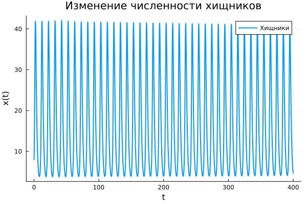
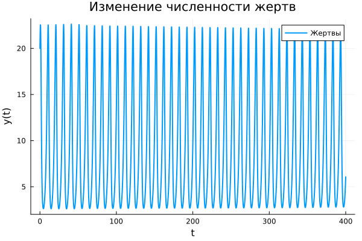
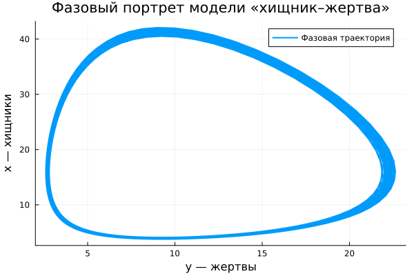

---
## Author
author:
  name: Никита Сахно НФИбд-02-23
  degrees: DSc
  orcid: 0000-0002-0877-7063
  email: 1132230298@rudn.ru
  affiliation:
    - name: Российский университет дружбы народов
      country: Российская Федерация
      postal-code: 117198
      city: Москва
      address: ул. Миклухо-Маклая, д. 6

## Title
title: "Лабораторная работа № 5"
subtitle: "Модель хищник-жертва"
license: "CC BY"

abstract: |
  В лабораторной работе исследуется математическая модель
  взаимодействия двух популяций типа «хищник — жертва».
  Выполнено численное решение системы дифференциальных уравнений
  в среде Julia, построены графики изменения численности хищников
  и жертв во времени, а также фазовый портрет системы.
  Найдены стационарные состояния модели.

keywords: [математическое моделирование, Julia, хищник-жертва, Лотка-Вольтерра]
---

# Введение

## Актуальность

Математическое моделирование позволяет исследовать изменение
численности взаимодействующих популяций и анализировать характер
их динамики во времени.

Одной из простейших математических моделей взаимодействия двух
видов является модель «хищник — жертва» Лотки-Вольтерры. Она
описывает взаимное влияние численности хищников и жертв и позволяет
исследовать возникающие колебания численности популяций.

## Цель работы

Целью работы является исследование математической модели
«хищник — жертва», выполнение численного решения системы
дифференциальных уравнений в среде Julia, построение графиков
изменения численности хищников и жертв во времени и фазового
портрета, а также нахождение стационарного состояния системы.

## Задачи

Постройте график зависимости численности хищников от численности жертв,
а также графики изменения численности хищников и численности жертв при
следующих начальных условиях:
00 xy  8, 20 . Найдите стационарное
состояние системы.

Для варианта 49 заданы начальные условия:

$$
x(0)=8,\qquad y(0)=20.
$$

## Объект и предмет исследования

Объектом исследования является система взаимодействующих
популяций хищников и жертв.

Предметом исследования является изменение численности хищников
и жертв во времени и характер их взаимного влияния.

## Методы исследования

В работе используются методы математического моделирования,
численного решения систем обыкновенных дифференциальных уравнений
и графического анализа результатов.

Для вычислений используется язык программирования Julia
и пакеты `DifferentialEquations` и `Plots`.

## Схема выполнения работы

```{mermaid}
graph TD
    A["Начало"] --> B["Задать параметры модели"]
    B --> C["Задать начальные условия"]
    C --> D["Сформировать систему дифференциальных уравнений"]
    D --> E["Решить систему численно"]
    E --> F["Построить графики"]
    F --> G["Найти стационарное состояние"]
    G --> H["Проанализировать результаты"]
    H --> I["Конец"]
```

# Теоретическая часть

Модель взаимодействия хищников и жертв описывается системой
обыкновенных дифференциальных уравнений:

$$
\frac{dx}{dt}=-ax+bxy,
$$

$$
\frac{dy}{dt}=cy-dxy.
$$

Здесь:

- $x$ — численность хищников;
- $y$ — численность жертв;
- $a$ — коэффициент естественного уменьшения численности хищников;
- $b$ — коэффициент влияния жертв на рост численности хищников;
- $c$ — коэффициент естественного роста численности жертв;
- $d$ — коэффициент влияния хищников на численность жертв.

Для варианта 49 используются значения:

| Параметр | Значение |
|:---:|:---:|
| $a$ | 0.76 |
| $b$ | 0.082 |
| $c$ | 0.62 |
| $d$ | 0.039 |

После подстановки коэффициентов система принимает вид:

$$
\frac{dx}{dt}=-0.76x+0.082xy,
$$

$$
\frac{dy}{dt}=0.62y-0.039xy.
$$

Для нахождения стационарного состояния необходимо приравнять
правые части системы к нулю:

$$
-ax+bxy=0,
$$

$$
cy-dxy=0.
$$

Нетривиальное стационарное состояние определяется выражениями:

$$
x^*=\frac{c}{d},
$$

$$
y^*=\frac{a}{b}.
$$

# Материалы и методы

Для выполнения лабораторной работы использовалась среда
программирования Julia.

Использованные пакеты:

```julia
using DifferentialEquations
using Plots
```

Интервал моделирования:

$$
t\in[0;400].
$$

Шаг сохранения результатов:

$$
\Delta t=0.1.
$$

Для численного решения системы использовался метод `Tsit5()`.

# Выполнение лабораторной работы

## Задание параметров модели

Для варианта 49 были заданы следующие коэффициенты:

```julia
a = 0.76
b = 0.082
c = 0.62
d = 0.039
```

Начальные условия:

```julia
x0 = 8.0
y0 = 20.0
```

## Задание системы дифференциальных уравнений

```julia
function predator_prey!(du, u, p, t)
    x, y = u

    du[1] = -a * x + b * x * y
    du[2] = c * y - d * x * y
end
```

## Численное решение системы

```julia
u0 = [x0, y0]

tspan = (0.0, 400.0)

prob = ODEProblem(predator_prey!, u0, tspan)

sol = solve(prob, Tsit5(), saveat=0.1)
```

## Построение графиков

### Изменение численности хищников

```julia
p1 = plot(
    sol.t,
    sol[1, :],
    xlabel = "t",
    ylabel = "x(t)",
    label = "Хищники",
    title = "Изменение численности хищников",
    linewidth = 2
)
```

### Изменение численности жертв

```julia
p2 = plot(
    sol.t,
    sol[2, :],
    xlabel = "t",
    ylabel = "y(t)",
    label = "Жертвы",
    title = "Изменение численности жертв",
    linewidth = 2
)
```

### Фазовый портрет

```julia
p3 = plot(
    sol[2, :],
    sol[1, :],
    xlabel = "y — жертвы",
    ylabel = "x — хищники",
    label = "Фазовая траектория",
    title = "Фазовый портрет модели «хищник–жертва»",
    linewidth = 2
)
```

## Сохранение графиков

```julia
savefig(p1, "predators.png")
savefig(p2, "prey.png")
savefig(p3, "phase_portrait.png")
```

## Вывод графиков

```julia
display(p1)
display(p2)
display(p3)
```

## Нахождение стационарного состояния

```julia
x_star = c / d
y_star = a / b

println("Стационарное состояние:")
println("x* = ", x_star)
println("y* = ", y_star)

println()
println("Тривиальное стационарное состояние:")
println("(x, y) = (0, 0)")
```

## Полный программный код

```julia
using DifferentialEquations
using Plots

a = 0.76
b = 0.082
c = 0.62
d = 0.039

function predator_prey!(du, u, p, t)
    x, y = u

    du[1] = -a * x + b * x * y
    du[2] = c * y - d * x * y
end

x0 = 8.0
y0 = 20.0

u0 = [x0, y0]

tspan = (0.0, 400.0)

prob = ODEProblem(predator_prey!, u0, tspan)

sol = solve(prob, Tsit5(), saveat=0.1)

p1 = plot(
    sol.t,
    sol[1, :],
    xlabel = "t",
    ylabel = "x(t)",
    label = "Хищники",
    title = "Изменение численности хищников",
    linewidth = 2
)

p2 = plot(
    sol.t,
    sol[2, :],
    xlabel = "t",
    ylabel = "y(t)",
    label = "Жертвы",
    title = "Изменение численности жертв",
    linewidth = 2
)

p3 = plot(
    sol[2, :],
    sol[1, :],
    xlabel = "y — жертвы",
    ylabel = "x — хищники",
    label = "Фазовая траектория",
    title = "Фазовый портрет модели «хищник–жертва»",
    linewidth = 2
)

savefig(p1, "predators.png")
savefig(p2, "prey.png")
savefig(p3, "phase_portrait.png")

display(p1)
display(p2)
display(p3)

x_star = c / d
y_star = a / b

println("Стационарное состояние:")
println("x* = ", x_star)
println("y* = ", y_star)

println()
println("Тривиальное стационарное состояние:")
println("(x, y) = (0, 0)")
```

# Результаты

В результате выполнения программы были получены три графика:
изменение численности хищников, изменение численности жертв
и фазовый портрет модели.

## Изменение численности хищников

{#fig-predators fig-cap="Изменение численности хищников во времени" width=90%}

На графике показано изменение численности хищников во времени.
Динамика хищников связана с изменением доступного количества жертв.

## Изменение численности жертв

{#fig-prey fig-cap="Изменение численности жертв во времени" width=90%}

График показывает изменение численности жертв во времени.
Количество жертв изменяется в зависимости от численности хищников.

## Фазовый портрет

{#fig-phase fig-cap="Фазовый портрет модели «хищник–жертва»" width=90%}

Фазовый портрет показывает взаимосвязь между численностью
хищников и жертв.

## Стационарное состояние

Нетривиальное стационарное состояние вычисляется по формулам:

$$
x^*=\frac{c}{d},
\qquad
y^*=\frac{a}{b}.
$$

Подставляя значения варианта 49:

$$
x^*=\frac{0.62}{0.039}
=15.897435897435898,
$$

$$
y^*=\frac{0.76}{0.082}
=9.268292682926829.
$$

Таким образом:

$$
\boxed{x^*=15.897435897435898}
$$

$$
\boxed{y^*=9.268292682926829}
$$

Также существует тривиальное стационарное состояние:

$$
\boxed{(x,y)=(0,0)}.
$$

Результат работы программы:

```text
Стационарное состояние:
x* = 15.897435897435898
y* = 9.268292682926829

Тривиальное стационарное состояние:
(x, y) = (0, 0)
```

# Обсуждение результатов

Полученные результаты показывают взаимосвязанную динамику двух
популяций. Изменение численности жертв влияет на рост или снижение
численности хищников, а изменение численности хищников, в свою
очередь, влияет на численность жертв.

На графиках изменения популяций во времени наблюдается
взаимосвязанный характер их динамики. Фазовый портрет позволяет
представить это взаимодействие в виде траектории на плоскости
численностей двух популяций.

Найденное ненулевое стационарное состояние соответствует значениям

$$
(x^*,y^*)=
(15.897435897435898,\;9.268292682926829).
$$

При этом обе производные системы равны нулю.

# Заключение

В ходе лабораторной работы была исследована математическая модель
«хищник — жертва» для варианта 49. Система дифференциальных
уравнений была реализована на языке Julia и решена численным
методом.

Были построены графики изменения численности хищников и жертв
во времени, а также фазовый портрет системы. Найдены два
стационарных состояния: тривиальное $(0,0)$ и нетривиальное

$$
(x^*,y^*)=
(15.897435897435898,\;9.268292682926829).
$$

Проведённый анализ показывает, что математическая модель позволяет
наглядно исследовать взаимное влияние популяций хищников и жертв
и характер изменения их численности во времени.

# Список литературы {.unnumbered}

::: {#refs}
:::

\appendix

# Что выносится в приложения {.appendix}

В приложения выносятся:

1. полный программный код на языке Julia;
2. график изменения численности хищников `predators.png`;
3. график изменения численности жертв `prey.png`;
4. фазовый портрет `phase_portrait.png`;
5. результаты расчёта стационарного состояния системы.