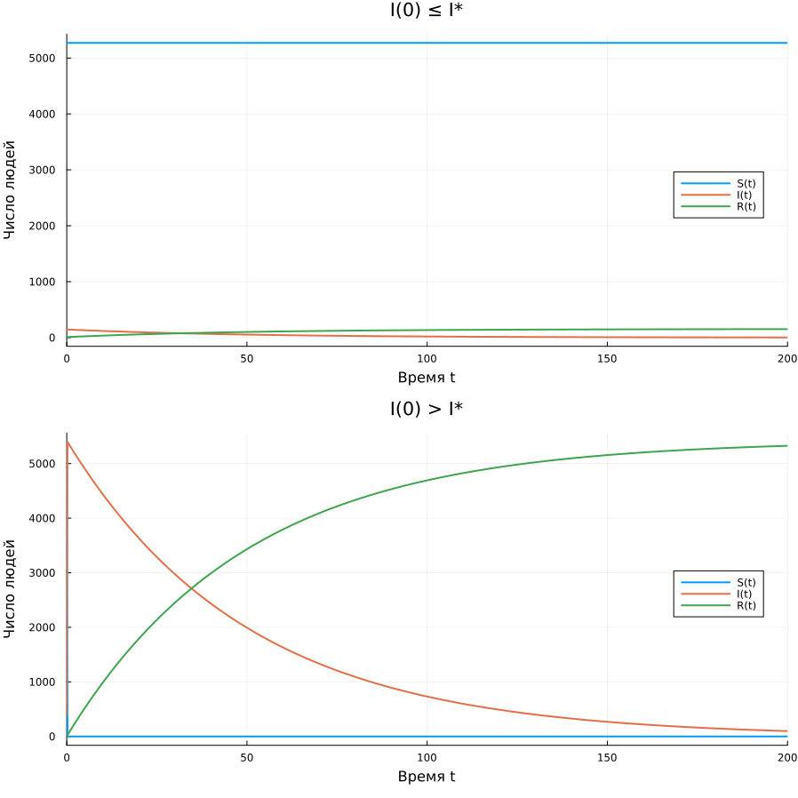

---
## Author
author:
  name: Никита Сахно НФИбд-02-23
  degrees: DSc
  orcid: 0000-0002-0877-7063
  email: 1132230298@rudn.ru
  affiliation:
    - name: Российский университет дружбы народов
      country: Российская Федерация
      postal-code: 117198
      city: Москва
      address: ул. Миклухо-Маклая, д. 6

## Title
title: "Лабораторная работа № 6"
subtitle: "Задача об эпидемии"
license: "CC BY"
abstract: |
  В данной лабораторной работе исследуется математическая модель
  распространения эпидемии в изолированной популяции.

  Рассматривается изменение численности восприимчивых,
  инфицированных и имеющих иммунитет особей. Выполнено численное
  моделирование в среде Julia для двух случаев развития эпидемии.

  Полученные результаты представлены в виде графика и проанализированы.
keywords: [лабораторная работа, математическое моделирование, Julia, эпидемия]
---

# Введение

## Актуальность

Математическое моделирование позволяет исследовать процессы
распространения инфекционных заболеваний и анализировать изменение
численности различных групп популяции во времени.

В простейшей модели эпидемии изолированная популяция разделяется
на три группы: восприимчивые к болезни, инфицированные и здоровые
особи, имеющие иммунитет. Исследование такой модели позволяет
определить характер развития эпидемии в зависимости от начального
числа инфицированных особей.

## Цель работы

Целью лабораторной работы является исследование математической
модели эпидемии, выполнение численного решения системы
дифференциальных уравнений в среде Julia и анализ изменения
численности трёх групп популяции во времени.

## Задачи

Для достижения поставленной цели необходимо:

- задать исходные параметры и начальные условия модели;
- сформировать систему дифференциальных уравнений;
- реализовать математическую модель в среде Julia;
- выполнить численное решение системы;
- построить графики изменения численности трёх групп;
- рассмотреть случай $I(0)\leq I^*$;
- рассмотреть случай $I(0)>I^*$;
- сравнить полученные результаты;
- сформулировать выводы по результатам моделирования.

## Объект и предмет исследования

Объектом исследования является изолированная популяция,
в которой распространяется инфекционное заболевание.

Предметом исследования является динамика численности
восприимчивых, инфицированных и имеющих иммунитет особей
при различных начальных условиях.

## Методы исследования

В работе используются методы математического моделирования,
численного решения систем обыкновенных дифференциальных уравнений
и графического анализа результатов.

Для выполнения расчётов используется язык программирования Julia
и пакеты `DifferentialEquations` и `Plots`.

## Схема выполнения работы

На рис. -@fig-flowchart представлена общая последовательность
действий при выполнении лабораторной работы.

::: {#fig-flowchart}

```{mermaid}
%%| fig-width: 100%
graph TD
    A@{ shape: circle, label: "Начало" } --> B[Задать параметры модели]
    B --> C[Задать начальные условия]
    C --> D[Сформировать систему дифференциальных уравнений]
    D --> E[Выполнить численное решение в Julia]
    E --> F[Построить график]
    F --> G[Проанализировать два случая]
    G --> H[Оформить результаты в отчёте]
    H --> I@{ shape: dbl-circ, label: "Конец" }
```

Блок-схема выполнения лабораторной работы

:::

# Теоретическая часть

Рассмотрим изолированную популяцию, состоящую из $N$ особей.
Популяция разделяется на три группы.

Первая группа $S(t)$ — восприимчивые к болезни, но пока
здоровые особи.

Вторая группа $I(t)$ — инфицированные особи, являющиеся
распространителями инфекции.

Третья группа $R(t)$ — здоровые особи, имеющие иммунитет
к заболеванию.

До тех пор, пока количество инфицированных не превышает
критического значения $I^*$, предполагается, что все больные
изолированы и не заражают восприимчивых особей.

Если выполняется условие

$$
I(t)>I^*,
$$

инфицированные особи начинают заражать восприимчивых.

Скорость изменения числа восприимчивых определяется системой:

$$
\frac{dS}{dt}=
\begin{cases}
-\alpha SI, & I>I^*,\\
0, & I\leq I^*.
\end{cases}
$$

Скорость изменения количества инфицированных:

$$
\frac{dI}{dt}=
\begin{cases}
\alpha SI-\beta I, & I>I^*,\\
-\beta I, & I\leq I^*.
\end{cases}
$$

Количество особей, получающих иммунитет, изменяется согласно:

$$
\frac{dR}{dt}=\beta I.
$$

Здесь $\alpha$ является коэффициентом заболеваемости,
а $\beta$ — коэффициентом выздоровления.

Для варианта 49 используются параметры:

$$
N=5424,
$$

$$
\alpha=0.01,
\qquad
\beta=0.02,
$$

$$
I^*=300.
$$

Начальные условия первого случая:

$$
I(0)=145,
\qquad
R(0)=9.
$$

Количество восприимчивых особей определяется как:

$$
S(0)=N-I(0)-R(0).
$$

Следовательно:

$$
S(0)=5424-145-9=5270.
$$

Таким образом:

$$
S(0)=5270,\qquad I(0)=145,\qquad R(0)=9.
$$

Поскольку

$$
145\leq300,
$$

первоначально рассматривается случай $I(0)\leq I^*$.

Для исследования второго случая начальное количество
инфицированных задаётся равным:

$$
I(0)=400.
$$

Тогда:

$$
S(0)=5424-400-9=5015,
$$

и выполняется условие:

$$
400>300.
$$

Таким образом, второй случай соответствует условию
$I(0)>I^*$.

# Материалы и методы

В работе использовался персональный компьютер и программное
обеспечение для выполнения численного моделирования.

Основные используемые средства:

- язык программирования Julia;
- пакет `DifferentialEquations` для численного решения системы
  дифференциальных уравнений;
- пакет `Plots` для построения графиков;
- Quarto для подготовки отчёта.

Моделирование выполнялось на интервале:

$$
0\leq t\leq200.
$$

Для каждого из двух случаев формировался вектор начальных
условий, после чего создавалась задача Коши и выполнялось
численное решение системы.

# Выполнение лабораторной работы

Сначала были заданы коэффициенты математической модели,
общая численность популяции и критическое количество
инфицированных:

```julia
using DifferentialEquations
using Plots

α = 0.01
β = 0.02
I_star = 300
N = 5424
```

Затем были заданы начальные условия для первого случая.
Количество восприимчивых вычислялось автоматически из общей
численности популяции:

```julia
I0_1 = 145
R0_1 = 9
S0_1 = N - I0_1 - R0_1
```

После этого была реализована функция математической модели.
В ней с помощью условного оператора проверялось, превышает ли
текущее количество инфицированных критическое значение:

```julia
function epidemic1!(du, u, p, t)
    S, I, R = u

    if I > I_star
        du[1] = -α * S * I
        du[2] = α * S * I - β * I
        du[3] = β * I
    else
        du[1] = 0
        du[2] = -β * I
        du[3] = β * I
    end
end
```

Для первого случая был сформирован вектор начальных значений
и задан интервал моделирования:

```julia
u0_1 = [S0_1, I0_1, R0_1]

tspan = (0.0, 200.0)

prob1 = ODEProblem(epidemic1!, u0_1, tspan)
sol1 = solve(prob1)
```

Затем аналогичным образом был рассмотрен второй случай,
для которого начальное количество инфицированных превышает
критическое:

```julia
I0_2 = 400
R0_2 = 9
S0_2 = N - I0_2 - R0_2

u0_2 = [S0_2, I0_2, R0_2]

prob2 = ODEProblem(epidemic1!, u0_2, tspan)
sol2 = solve(prob2)
```

После получения численных решений для каждого случая были
построены графики изменения функций $S(t)$, $I(t)$ и $R(t)$:

```julia
p1 = plot(
    sol1,
    xlabel = "Время t",
    ylabel = "Число людей",
    label = ["S(t)" "I(t)" "R(t)"],
    title = "Случай I(0) ≤ I*",
    linewidth = 2,
    legend = :right
)

p2 = plot(
    sol2,
    xlabel = "Время t",
    ylabel = "Число людей",
    label = ["S(t)" "I(t)" "R(t)"],
    title = "Случай I(0) > I*",
    linewidth = 2,
    legend = :right
)
```

Для удобства сравнения два графика были объединены в один рисунок:

```julia
p = plot(
    p1,
    p2,
    layout = (2, 1),
    size = (900, 900)
)
```

Полученный рисунок был сохранён в рабочую папку:

```julia
savefig(
    p,
    raw"C:\Users\nikit\Desktop\JuliaLabs\lab6_variant49.png"
)
```

## Результаты

В результате численного моделирования был получен общий график,
содержащий результаты для двух рассматриваемых случаев.

На верхней части рисунка представлен случай

$$
I(0)\leq I^*,
$$

где

$$
I(0)=145,\qquad I^*=300.
$$

На нижней части рисунка представлен случай

$$
I(0)>I^*,
$$

где

$$
I(0)=400,\qquad I^*=300.
$$

На каждом графике представлены три зависимости:
$S(t)$ — число восприимчивых, $I(t)$ — число инфицированных
и $R(t)$ — число особей с иммунитетом.

{#fig-001 width=90%}

На рис. -@fig-001 приведён результат численного моделирования
двух случаев развития эпидемии.

# Обсуждение результатов

В первом случае начальное количество инфицированных составляет
145 особей и не превышает критического значения 300.

Поэтому заражение восприимчивых особей не происходит.
Численность группы $S(t)$ остаётся постоянной, количество
инфицированных $I(t)$ уменьшается за счёт выздоровления,
а количество особей с иммунитетом $R(t)$ увеличивается.

Во втором случае начальное количество инфицированных равно
400 особям и превышает критическое значение.

В результате начинается заражение восприимчивых особей.
Поэтому численность $S(t)$ уменьшается. Динамика $I(t)$
определяется одновременно процессами заражения и выздоровления,
а $R(t)$ увеличивается по мере выздоровления инфицированных.

Таким образом, изменение начального количества инфицированных
относительно критического значения $I^*$ существенно влияет
на характер протекания эпидемии.

# Заключение

- Цель лабораторной работы достигнута: математическая модель
  эпидемии была реализована и исследована численно.
- Для варианта 49 были использованы параметры
  $N=5424$, $\alpha=0.01$, $\beta=0.02$ и $I^*=300$.
- Были рассмотрены два случая: $I(0)\leq I^*$ и $I(0)>I^*$.
- При $I(0)\leq I^*$ заражение восприимчивых особей не происходит,
  а количество инфицированных уменьшается.
- При $I(0)>I^*$ начинается распространение инфекции,
  что приводит к уменьшению количества восприимчивых особей.
- Полученные результаты позволяют наглядно сравнить два режима
  развития эпидемии.

# Список литературы {.unnumbered}

::: {#refs}
:::

\appendix

# Что выносится в приложения {.appendix}

## Приложение А. Листинг программы

Полный листинг программы на языке Julia:

```julia
using DifferentialEquations
using Plots

α = 0.01
β = 0.02
I_star = 300
N = 5424

I0_1 = 145
R0_1 = 9
S0_1 = N - I0_1 - R0_1

function epidemic1!(du, u, p, t)
    S, I, R = u

    if I > I_star
        du[1] = -α * S * I
        du[2] = α * S * I - β * I
        du[3] = β * I
    else
        du[1] = 0
        du[2] = -β * I
        du[3] = β * I
    end
end

u0_1 = [S0_1, I0_1, R0_1]

tspan = (0.0, 200.0)

prob1 = ODEProblem(epidemic1!, u0_1, tspan)
sol1 = solve(prob1)

I0_2 = 400
R0_2 = 9
S0_2 = N - I0_2 - R0_2

u0_2 = [S0_2, I0_2, R0_2]

prob2 = ODEProblem(epidemic1!, u0_2, tspan)
sol2 = solve(prob2)

p1 = plot(
    sol1,
    xlabel = "Время t",
    ylabel = "Число людей",
    label = ["S(t)" "I(t)" "R(t)"],
    title = "Случай I(0) ≤ I*",
    linewidth = 2,
    legend = :right
)

p2 = plot(
    sol2,
    xlabel = "Время t",
    ylabel = "Число людей",
    label = ["S(t)" "I(t)" "R(t)"],
    title = "Случай I(0) > I*",
    linewidth = 2,
    legend = :right
)

p = plot(
    p1,
    p2,
    layout = (2, 1),
    size = (900, 900)
)

savefig(
    p,
    raw"C:\Users\nikit\Desktop\JuliaLabs\lab6_variant49.png"
)
```